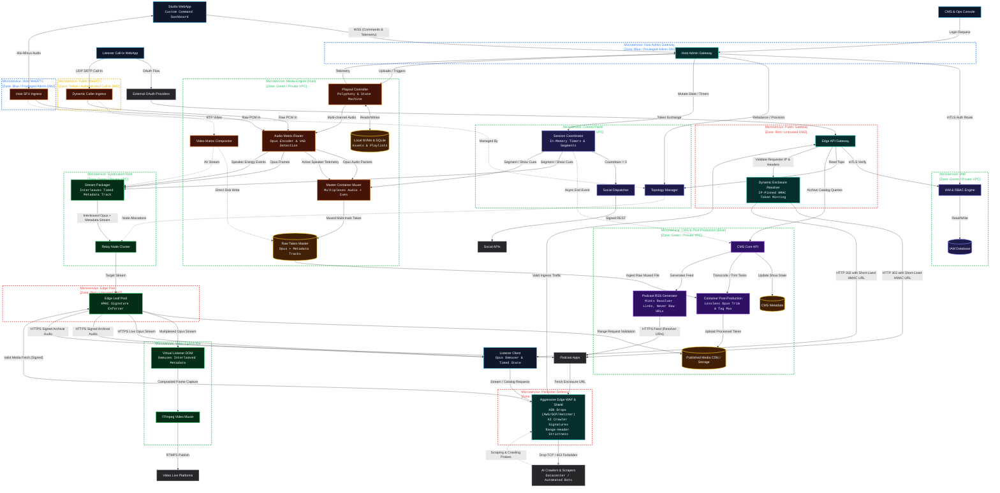

```mermaid
flowchart TD
    %% -------------------------------------------------------------
    %% SEMANTIC NODE STYLING
    %% -------------------------------------------------------------
    classDef client fill:#0f172a,stroke:#38bdf8,stroke-width:2px,color:#f8fafc;
    classDef gateway fill:#042f2e,stroke:#2dd4bf,stroke-width:2px,color:#f8fafc;
    classDef control fill:#1e1b4b,stroke:#818cf8,stroke-width:2px,color:#f8fafc;
    classDef mixer fill:#431407,stroke:#fb923c,stroke-width:2px,color:#f8fafc;
    classDef syndication fill:#052e16,stroke:#4ade80,stroke-width:2px,color:#f8fafc;
    classDef cms fill:#2e1065,stroke:#c084fc,stroke-width:2px,color:#f8fafc;
    classDef storage fill:#422006,stroke:#facc15,stroke-width:2px,color:#f8fafc;
    classDef external fill:#27272a,stroke:#94a3b8,stroke-width:2px,stroke-dasharray: 2 2,color:#f8fafc;
    
    %% ZONE BOUNDARY STYLING
    classDef zone_red fill:none,stroke:#ef4444,stroke-width:3px,stroke-dasharray: 5 5,color:#ef4444;
    classDef zone_yellow fill:none,stroke:#eab308,stroke-width:3px,stroke-dasharray: 5 5,color:#eab308;
    classDef zone_blue fill:none,stroke:#3b82f6,stroke-width:3px,stroke-dasharray: 5 5,color:#3b82f6;
    classDef zone_green fill:none,stroke:#22c55e,stroke-width:3px,stroke-dasharray: 5 5,color:#22c55e;

    %% -------------------------------------------------------------
    %% TIER 0: CLIENT APPS & EXTERNAL AGENTS
    %% -------------------------------------------------------------
    Ext_IdP["External OAuth Providers"]
    FE_Admin["CMS & Ops Console"]
    FE_Studio["Studio WebApp<br/><code>Custom Command Dashboard</code>"]
    FE_CallIn["Listener Call-In WebApp"]
    FE_Listener_Stream["Listener Client<br/><code>Opus Demuxer & Timed State</code>"]
    Ext_Aggregators["Podcast Apps"]
    Scraper_Threats["AI Crawlers & Scrapers<br/><code>Datacenter / Automated Bots</code>"]

    %% -------------------------------------------------------------
    %% TIER 1: RED ZONE (UNTRUSTED PUBLIC DMZ WITH AGGRESSIVE SHIELD)
    %% -------------------------------------------------------------
    subgraph Svc_Edge_Shield ["Microservice: Perimeter Defense<br/>[Zone: Red / Untrusted DMZ]"]
        Edge_WAF_Shield["Aggressive Edge WAF & Shield<br/><code>ASN Drops (AWS/GCP/Hetzner)<br/>AI Crawler Signatures<br/>Range-Header Strictness</code>"]
    end
    class Svc_Edge_Shield zone_red

    subgraph Svc_Gateway_Public ["Microservice: Public Gateway<br/>[Zone: Red / Untrusted DMZ]"]
        GW_Public["Edge API Gateway"]
        Mod_EnclosureResolver["Dynamic Enclosure Resolver<br/><code>IP-Pinned HMAC Token Minting</code>"]
    end
    class Svc_Gateway_Public zone_red

    subgraph Svc_Edge_Public ["Microservice: Edge Pool<br/>[Zone: Red / Untrusted DMZ]"]
        Edge_Leaf["Edge Leaf Pool<br/><code>HMAC Signature Enforcer</code>"]
    end
    class Svc_Edge_Public zone_red

    %% -------------------------------------------------------------
    %% TIER 1.5: YELLOW ZONE (AUTHENTICATED CALL-IN DMZ)
    %% -------------------------------------------------------------
    subgraph Svc_WebRTC_Public ["Microservice: Public WebRTC<br/>[Zone: Yellow / Authenticated Call-In DMZ]"]
        Dyn_CallerIngress["Dynamic Caller Ingress"]
    end
    class Svc_WebRTC_Public zone_yellow

    %% -------------------------------------------------------------
    %% TIER 1.8: BLUE ZONE (PRIVILEGED ADMIN DMZ)
    %% -------------------------------------------------------------
    subgraph Svc_Gateway_Admin ["Microservice: Host Admin Gateway<br/>[Zone: Blue / Privileged Admin DMZ]"]
        GW_HostAdmin["Host Admin Gateway"]
    end
    class Svc_Gateway_Admin zone_blue

    subgraph Svc_WebRTC_Host ["Microservice: Host WebRTC<br/>[Zone: Blue / Privileged Admin DMZ]"]
        Mod_HostVoIP["Host SFU Ingress"]
    end
    class Svc_WebRTC_Host zone_blue

    %% -------------------------------------------------------------
    %% TIER 2: GREEN ZONE (PRIVATE VPC / CORE)
    %% -------------------------------------------------------------
    subgraph Svc_Auth ["Microservice: IAM<br/>[Zone: Green / Private VPC]"]
        Mod_Auth["IAM & RBAC Engine"]
        DB_IAM[("IAM Database")]
    end
    class Svc_Auth zone_green

    subgraph Svc_Control ["Microservice: Control Plane<br/>[Zone: Green / Private VPC]"]
        Mod_Lifecycle["Session Coordinator<br/><code>In-Memory Timers & Segments</code>"]
        Mod_Orchestrator["Topology Manager"]
        Mod_Notifier["Social Dispatcher"]
    end
    class Svc_Control zone_green

    subgraph Svc_MediaEngine ["Microservice: Media Engine (Rust)<br/>[Zone: Green / Private VPC]"]
        DB_LocalAssets[("Local NVMe & SQLite<br/><code>Assets & Playlists</code>")]
        Mod_PlayoutController["Playout Controller<br/><code>Polyphony & State Machine</code>"]
        Mod_Mixer["Audio Matrix Router<br/><code>Opus Encoder & VAD Detection</code>"]
        Mod_MasterRecorder["Master Container Muxer<br/><code>Multiplexes Audio + Cues</code>"]
        Mod_VideoComp["Video Matrix Compositor"]
        DB_Raw[("Raw Takes Master<br/><code>Opus + Metadata Tracks</code>")]
    end
    class Svc_MediaEngine zone_green

    %% -------------------------------------------------------------
    %% TIER 3: GREEN ZONE (PIPELINES & SYNDICATION)
    %% -------------------------------------------------------------
    subgraph Svc_CMS ["Microservice: CMS & Post-Production (Elixir)<br/>[Zone: Green / Private VPC]"]
        Mod_CMS_API["CMS Core API"]
        Mod_PostProd["Container Post-Production<br/><code>Lossless Opus Trim & Tag Mux</code>"]
        Mod_RSS["Podcast RSS Generator<br/><code>Mints Resolver Links, Never Raw URLs</code>"]
        DB_CMS[("CMS Metadata")]
        DB_Artifacts[("Published Media CDN / Storage")]
    end
    class Svc_CMS zone_green

    subgraph Svc_Edge_Internal ["Microservice: Syndication Root<br/>[Zone: Green / Private VPC]"]
        Mod_Packager["Stream Packager<br/><code>Interleaves Timed Metadata Track</code>"]
        Edge_Root["Relay Node Cluster"]
    end
    class Svc_Edge_Internal zone_green

    subgraph Svc_Video ["Microservice: Video Egress Bot<br/>[Zone: Green / Private VPC]"]
        Mod_VirtualListener["Virtual Listener DOM<br/><code>Demuxes Interleaved Metadata</code>"]
        Mod_RTMP_Muxer["FFmpeg Video Muxer"]
    end
    class Svc_Video zone_green

    %% -------------------------------------------------------------
    %% TIER 4: EXTERNAL SINKS & PLATFORMS
    %% -------------------------------------------------------------
    Ext_Social["Social APIs"]
    Ext_VideoPlatforms["Video Live Platforms"]

    %% -------------------------------------------------------------
    %% CLASS ASSIGNMENTS
    %% -------------------------------------------------------------
    class Ext_IdP,Ext_Social,Ext_VideoPlatforms,Ext_Aggregators,Scraper_Threats external;
    class FE_Studio,FE_Admin,FE_CallIn,FE_Listener_Stream client;
    class GW_HostAdmin,GW_Public,Edge_WAF_Shield,Mod_EnclosureResolver gateway;
    class Mod_Auth,DB_IAM control;
    class Mod_Lifecycle,Mod_Orchestrator,Mod_Notifier control;
    class Mod_HostVoIP,Dyn_CallerIngress,Mod_PlayoutController,Mod_Mixer,Mod_MasterRecorder,Mod_VideoComp mixer;
    class Mod_Packager,Edge_Root,Edge_Leaf,Mod_VirtualListener,Mod_RTMP_Muxer syndication;
    class Mod_CMS_API,Mod_PostProd,Mod_RSS cms;
    class DB_LocalAssets,DB_Raw,DB_CMS,DB_Artifacts storage;

    %% -------------------------------------------------------------
    %% 1. INGRESS & PERIMETER DEFENSE
    %% -------------------------------------------------------------
    Scraper_Threats -.->|"Scraping & Crawling Probes"| Edge_WAF_Shield
    Edge_WAF_Shield --x|"Drop TCP / 403 Forbidden"| Scraper_Threats

    Ext_Aggregators -->|"Fetch Enclosure URL"| Edge_WAF_Shield
    FE_Listener_Stream -->|"Stream / Catalog Requests"| Edge_WAF_Shield

    Edge_WAF_Shield -->|"Valid Ingress Traffic"| GW_Public
    Edge_WAF_Shield -->|"Valid Media Fetch (Signed)"| Edge_Leaf

    FE_CallIn -->|"OAuth Flow"| Ext_IdP
    Ext_IdP -->|"Token Exchange"| GW_Public
    GW_Public -->|"mTLS Verify"| Mod_Auth
    FE_Admin -->|"Login Request"| GW_HostAdmin
    GW_HostAdmin -->|"mTLS Auth Route"| Mod_Auth
    Mod_Auth -->|"Read/Write"| DB_IAM

    GW_Public -->|"Read Topo"| Mod_Orchestrator
    GW_HostAdmin -->|"Rebalance / Provision"| Mod_Orchestrator
    Dyn_CallerIngress -.->|"Managed By"| Mod_Orchestrator
    Mod_Orchestrator -.->|"Node Allocations"| Edge_Root

    %% -------------------------------------------------------------
    %% 2. CONTROL PLANE & DASHBOARD COMMANDS
    %% -------------------------------------------------------------
    FE_Studio -->|"WSS (Commands & Telemetry)"| GW_HostAdmin
    GW_HostAdmin -->|"Mutate State / Timers"| Mod_Lifecycle
    
    Mod_Lifecycle -->|"Countdown = 0"| Mod_Notifier
    Mod_Lifecycle -.->|"Async End Event"| Mod_CMS_API
    Mod_Lifecycle -->|"Segment / Show Cues"| Mod_Packager
    Mod_Lifecycle -->|"Segment / Show Cues"| Mod_MasterRecorder

    %% -------------------------------------------------------------
    %% 3. LIVE MEDIA ENGINE
    %% -------------------------------------------------------------
    FE_Studio <-->|"Mix-Minus Audio"| Mod_HostVoIP
    GW_HostAdmin -->|"Uploads / Triggers"| Mod_PlayoutController
    
    Mod_PlayoutController <-->|"Reads/Writes"| DB_LocalAssets
    Mod_PlayoutController -->|"Telemetry"| GW_HostAdmin
    Mod_PlayoutController -->|"Multi-channel Audio"| Mod_Mixer

    FE_CallIn -->|"UDP SRTP Call-In"| Dyn_CallerIngress

    Mod_HostVoIP -->|"Raw PCM In"| Mod_Mixer
    Dyn_CallerIngress -->|"Raw PCM In"| Mod_Mixer
    
    Mod_HostVoIP -.->|"RTP Video"| Mod_VideoComp

    Mod_Mixer -->|"Opus Audio Packets"| Mod_MasterRecorder
    Mod_Mixer -->|"Active Speaker Telemetry"| Mod_MasterRecorder
    Mod_MasterRecorder -->|"Muxed Multi-track Takes"| DB_Raw
    Mod_VideoComp -.->|"Direct Disk Write"| DB_Raw

    %% -------------------------------------------------------------
    %% 4. POST-PRODUCTION & ANTI-SCRAPING SYNDICATION
    %% -------------------------------------------------------------
    GW_Public -->|"Archive Catalog Queries"| Mod_CMS_API
    Mod_CMS_API -->|"Update Show State"| DB_CMS
    
    DB_Raw -->|"Ingest Raw Muxed File"| Mod_PostProd
    Mod_CMS_API -->|"Transcode / Trim Tasks"| Mod_PostProd
    Mod_PostProd -->|"Upload Processed Takes"| DB_Artifacts
    
    Mod_CMS_API -->|"Generates Feed"| Mod_RSS
    Mod_RSS -->|"HTTPS Feed (Resolver URIs)"| Ext_Aggregators

    %% Dynamic Enclosure Redirection Flow
    GW_Public -->|"Validate Requester IP & Headers"| Mod_EnclosureResolver
    Mod_EnclosureResolver -->|"HTTP 302 with Short-Lived HMAC URL"| Ext_Aggregators
    Mod_EnclosureResolver -->|"HTTP 302 with Short-Lived HMAC URL"| FE_Listener_Stream

    %% Media Egress Execution
    Edge_Leaf -->|"Range Request Validation"| DB_Artifacts

    %% -------------------------------------------------------------
    %% 5. LIVE SYNDICATION & EDGE
    %% -------------------------------------------------------------
    Mod_Mixer -->|"Opus Frames"| Mod_Packager
    Mod_Mixer -->|"Speaker Energy Events"| Mod_Packager
    Mod_VideoComp -.->|"AV Stream"| Mod_Packager
    
    Mod_Packager -->|"Interleaved Opus + Metadata Stream"| Edge_Root
    Edge_Root -->|"Target Stream"| Edge_Leaf

    %% -------------------------------------------------------------
    %% 6. EGRESS BOTS & CONSUMPTION
    %% -------------------------------------------------------------
    Edge_Leaf -->|"Multiplexed Opus Stream"| Mod_VirtualListener
    Mod_VirtualListener -->|"Composited Frame Capture"| Mod_RTMP_Muxer
    Mod_RTMP_Muxer -->|"RTMPS Publish"| Ext_VideoPlatforms

    Mod_Notifier -->|"Signed REST"| Ext_Social

    %% Playback Paths
    Edge_Leaf -->|"HTTPS Live Opus Stream"| FE_Listener_Stream
    Edge_Leaf -->|"HTTPS Signed Archival Audio"| FE_Listener_Stream
    Edge_Leaf -->|"HTTPS Signed Archival Audio"| Ext_Aggregators
```
